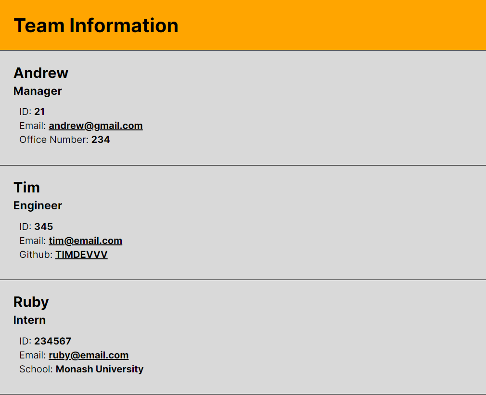

# Team Profile Generator

## Description

This project can be used by managers at all levels who want to build teams and have key information easily accessible to them. Add engineers or interns to your team and you will be able to see their employee ID along with their email address. Clicking on the email address will open up your email application with the employees email already filled in. 

Each employee type receives their own special field. Managers receive their office number within their card. While engineers show their github account with a link to their profile. Lastly, the interns card displays the school they are/did attend.

## Table of Contents

- [Installation](#installation)
- [Usage](#usage)
- [Contribution](#contribution)
- [Tests](#tests)
- [License](#license)

## Installation

To install this project and generate README files you will first need to clone this repository. After you have got it on your machine you will need to open an integrated terminal and run 'npm i' or 'npm install' this will download the package needed to run the prompts.  

## Usage

Once installed you can run 'node ./index.js' from the command line. Then follow the prompts and build your team.  

Here is a quick video explaining how the application works. https://drive.google.com/file/d/1VJXvaWrwiicnC_doO0bI1VGIVd95sAKi/view?usp=sharing

And here is an image of what the outcome of the application will look like after entering in your team 

## Contribution

I would like to give credit to my bootcamp's instructors and Ask BCS!

## Tests

To ensure the classes worked correctly they were all individually tested in their own suite. Be sure to checkout the test folder or run 'npm test' after you have cloned and set up the repository. 

## License

This project is covered under the Apache License 2.0 which you can read in depth here https://spdx.org/licenses/Apache-2.0.html